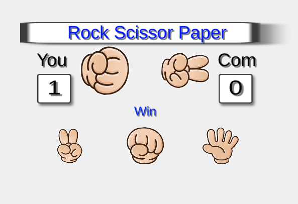

# Class-2DGameProgramming

2D Game Programming (Game Content)

## chapter 4 Rock Scissors Paper Game

Rock paper scissors is an intransitive hand game, usually played between two people, in which each player simultaneously forms one of three shapes with an outstretched hand.

### Platform

- Windows, Android (Samsung Galaxy Note 10)

### 게임방법

- 게임 플레이어는 컴퓨터와 가위바위보 내밀어 승부를 결정 
- 컴퓨터는 (단순하게) 랜덤함수로 가위(1)바위(2)보(3)를 선택

### Scenes

</img>
